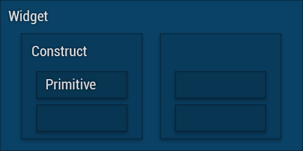

<div align="center">@eCrowJS</div>
<h1 align="center">Visual</h1>

eCrow Visual is a general purpose universal component library developed with ReactJS using ES6/TypeScript syntax. The library has it's own isolated environment to test, build, and document components before use in an application.

## Table of Contents

- [Getting Started](#getting-started)
- [Running the Application](#running-the-application)
- [Development](#development)
  - [Creating Components](#creating-components)
  - [Component Types](#component-types)
- [Building](#building)
  - [Web Application](#web-application)
  - [Distribution](#distribution)
  - [Library](#library)

## Getting Started

Clone the repository with SSH or HTTPS.

```bash
# SSH
git clone git@github.com:ecrow-ltd/web-visual.git

# HTTPS
git clone https://github.com/ecrow-ltd/web-visual.git
```

Navigate in the directory of the newly cloned repository using NPM or Yarn.

```bash
cd web-visual

# NPM
npm install

# Yarn
yarn install
```

## Running the Application

Running the application is easy after completing the [Getting Started](#getting-started) section. Simply run the following command from within the web-visual directory:

```bash
yarn start
```

After a bit of time, a server will be started along with a clickable URL in the terminal.

The URL is `http://localhost:2769` or `http://127.0.0.1:2769` on the same system that `yarn start` was executed.

## Development

### Creating Components

Creating a component starts by executing the command below in the following fashion...

```bash
yarn new <type> <name>
```

| Argument | Description                                                          |
| :------: | :------------------------------------------------------------------- |
| `<type>` | One of three component types: `primitive`, `construct`, or `widget`. |
| `<name>` | Creates a new component with this name. Example: `Button`.           |

Once done, your new component will be created in the following directory `src/components/<type>/` containing the source files listed below.

| File Name          | Description                                                                                        |
| :----------------- | :------------------------------------------------------------------------------------------------- |
| `<name>.tsx`       | The React Component. Primitive components will also have a component for styling.                  |
| `<name>.test.tsx`  | A Jest Unit Test for the React Component.                                                          |
| `<name>.story.tsx` | A Storybook story for generating a page to test and display documentation for the React Component. |
| `index.ts`         | An index for exporting the React Component at the directory level.                                 |

If you're [Running the Application](#running-the-application), you'll be able to see your component after refreshing the browser page. Afterwards, changes you make will automatically update in the browser.

### Component Types



There are three levels of components: Primitive, Construct, and Widget components; each getting more intelligent through composition.

- **Primitive** components are the most basic components consisting of raw HTML/JSX elements or a single composition of another Primitive component. They are also the only _styled_ component.
- **Construct** components compose of two or more _Primitive_ or other _Construct_ components. Like a login form consisting of two Primitive input fields.
- **Widget** components are complex components that react to structured data while composing of Construct and/or Primitive components.

## Building

### Web Application

To build the web application, use the following command.

```bash
yarn build:storybook
```

This will generate static web files under the folder `.build`.

### Distribution

To build this project as a minified and packaged UMD distribution, use the following command.

```bash
yarn build:dist
```

This will generate a debug and production use minified JavaScript file under the folder `.dist`.

### Library

To build the project as a library, use the following command.

```bash
yarn build:lib
```

This will generate a transpiled component modules with TypeScript declarations under the folder `.lib`. This is where NPM/Yarn will look for the main entry file.
